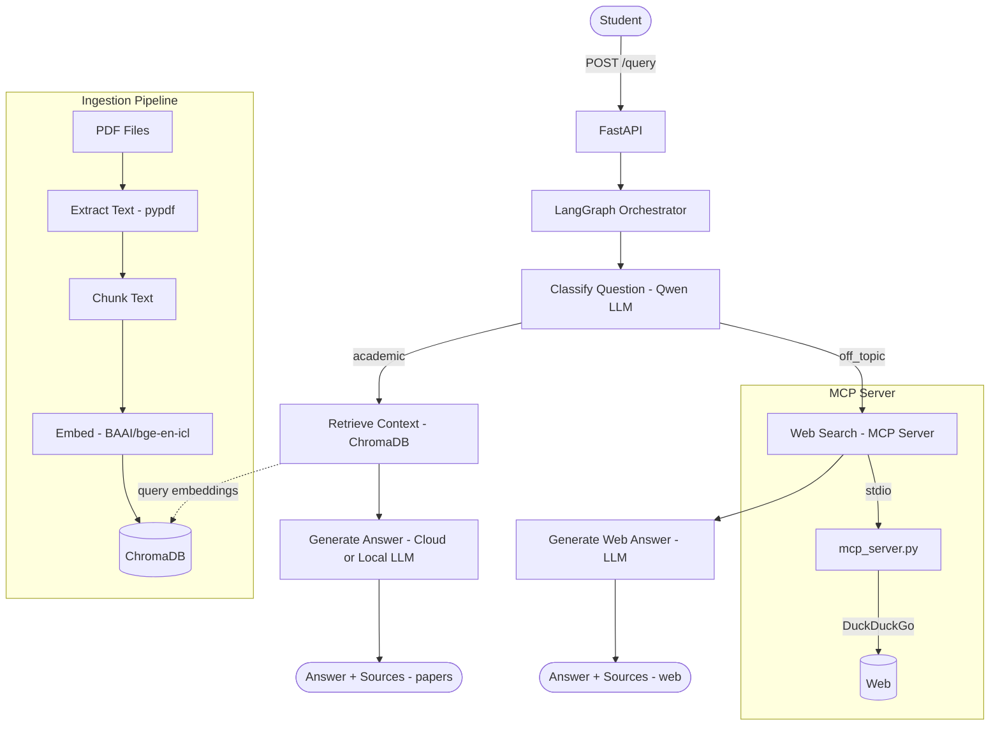

# Student Q&A System

A production-ready RAG (Retrieval Augmented Generation) pipeline that lets students query academic papers conversationally. Built with FastAPI, LangGraph, ChromaDB, and MCP (Model Context Protocol). Supports both cloud and local (air gap) LLM inference, with MCP-powered web search fallback for non-academic questions.

## Architecture



## Features

- **PDF Ingestion** — loads academic papers, chunks text, embeds and stores in ChromaDB
- **Semantic Search** — vector similarity search to retrieve relevant context
- **LangGraph Orchestration** — classifies questions and routes to the right pipeline
- **MCP Tool Integration** — off-topic questions fall back to web search via an MCP server (Model Context Protocol)
- **Provider-Agnostic** — one env variable switches between cloud (Nebius) and local (Ollama) LLM
- **Air Gap Ready** — set `USE_LOCAL=true` to run fully offline with Ollama, no internet required
- **Dockerized** — runs as a container, deployable anywhere

## Tech Stack

| Layer         | Technology                                                   |
| ------------- | ------------------------------------------------------------ |
| API           | FastAPI + Pydantic                                           |
| Orchestration | LangGraph                                                    |
| Tool Protocol | MCP (Model Context Protocol)                                 |
| Vector DB     | ChromaDB                                                     |
| Web Search    | DuckDuckGo (via ddgs + MCP)                                  |
| Embeddings    | Configurable via `EMBED_MODEL` (default: Qwen3-Embedding-8B) |
| Cloud LLM     | Configurable via `CLOUD_LLM_MODEL` (default: Qwen3-235B)     |
| Local LLM     | Configurable via `LOCAL_LLM_MODEL` (default: gemma3:4b)      |
| Deployment    | Docker + docker-compose                                      |

## Project Structure

```
Student-QA/
├── main.py            # FastAPI app — POST /query endpoint
├── orchestrator.py    # LangGraph graph — classify → retrieve/web_search → generate
├── query.py           # Embedding search + LLM answer generation (papers + web)
├── mcp_server.py      # MCP server — exposes web_search tool via DuckDuckGo
├── ingest.py          # One-time PDF ingestion pipeline
├── Dockerfile         # Container definition
├── docker-compose.yml # Multi-container orchestration
├── requirements.txt   # Python dependencies
├── .env               # Environment variables (not committed)
└── Sample PDFs/       # Academic papers to ingest
```

## Getting Started

### 1. Clone and install

```bash
git clone <repo-url>
cd Student-QA
python -m venv venv
venv\Scripts\activate      # Windows
pip install -r requirements.txt
```

### 2. Set up environment variables

Create a `.env` file:

```env
USE_LOCAL=false
OLLAMA_BASE_URL=http://localhost:11434/v1
NEBIUS_API_KEY=your_nebius_api_key
NEBIUS_BASE_URL=https://api.studio.nebius.ai/v1
EMBED_MODEL=Qwen/Qwen3-Embedding-8B                        you can use your own models here
CLOUD_LLM_MODEL=Qwen/Qwen3-235B-A22B-Instruct-2507
LOCAL_LLM_MODEL=gemma3:4b
```

### 3. Ingest PDFs

Place PDF files in the `Sample PDFs/` folder, then run:

```bash
python ingest.py
```

### 4. Run the API

**Option A — directly:**

```bash
uvicorn main:app --reload
```

**Option B — via Docker:**

```bash
docker-compose up --build
```

### 5. Test

Open `http://localhost:8000/docs` in your browser and use the Swagger UI.

## API

### POST /query

**Request:**

```json
{
  "question": "What are the main components of a RAG system?"
}
```

**Response (academic question — from papers):**

```json
{
  "answer": "A RAG system consists of...",
  "sources": ["paper1.pdf", "paper2.pdf"],
  "source_type": "papers"
}
```

**Request:**

```json
{
  "question": "Who is virat kohli?"
}
```

**Response (general question — from web search via MCP):**

```json
{
  "answer": "Virat Kohli is an Indian cricketer...",
  "sources": ["web search"],
  "source_type": "web"
}
```

## MCP Integration

The system uses [Model Context Protocol (MCP)](https://modelcontextprotocol.io/) to integrate external tools with the LangGraph orchestrator.

**How it works:**

1. LangGraph classifies the question as academic or off-topic
2. Off-topic questions trigger the `web_search_node` in LangGraph
3. This node acts as an MCP client — it spawns `mcp_server.py` as a subprocess via stdio
4. The MCP server exposes a `web_search` tool that queries DuckDuckGo
5. Results are passed back to the LLM for answer generation

**Why MCP instead of a direct API call?**

- Standardized protocol — any MCP client can use the same server
- Dynamic tool discovery — the client discovers available tools at runtime
- Reusable — the web search MCP server can be plugged into Claude Desktop, Cursor, or any MCP-compatible client

## Cloud vs Local (Air Gap) Mode

| Setting           | LLM                       | Use Case                  |
| ----------------- | ------------------------- | ------------------------- |
| `USE_LOCAL=false` | Nebius cloud (Qwen3-235B) | Fast, high quality        |
| `USE_LOCAL=true`  | Ollama local (Llama3)     | Offline, private, air gap |

> Embeddings always use Nebius for consistency — switching embedding models requires re-ingestion.

To switch to local mode, update `.env`:

```env
USE_LOCAL=true
```

And ensure Ollama is running with the model pulled:

```bash
ollama pull gemma3:4b
```
