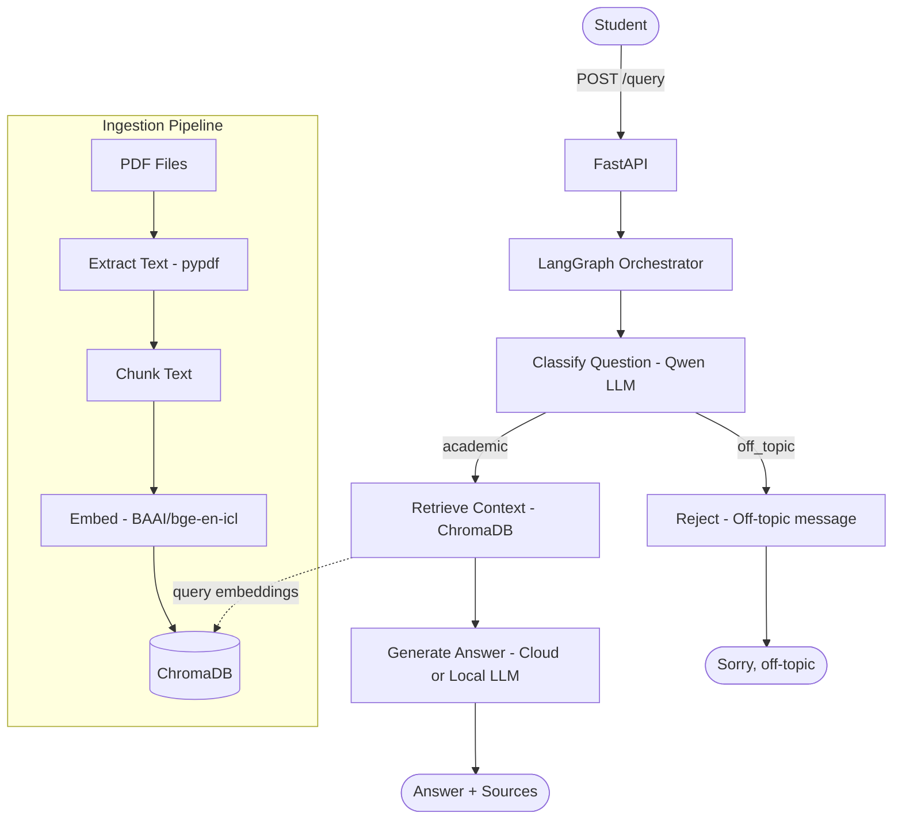

# Student Q&A System

A production-ready RAG (Retrieval Augmented Generation) pipeline that lets students query academic papers conversationally. Built with FastAPI, LangGraph, ChromaDB, and supports both cloud and local (air gap) LLM inference.

## Architecture



## Features

- **PDF Ingestion** — loads academic papers, chunks text, embeds and stores in ChromaDB
- **Semantic Search** — vector similarity search to retrieve relevant context
- **LangGraph Orchestration** — classifies questions before answering; rejects off-topic queries
- **Provider-Agnostic** — one env variable switches between cloud (Nebius) and local (Ollama) LLM
- **Air Gap Ready** — set `USE_LOCAL=true` to run fully offline with Ollama, no internet required
- **Dockerized** — runs as a container, deployable anywhere

## Tech Stack

| Layer         | Technology                    |
| ------------- | ----------------------------- |
| API           | FastAPI + Pydantic            |
| Orchestration | LangGraph                     |
| Vector DB     | ChromaDB                      |
| Embeddings    | BAAI/bge-en-icl (Nebius)      |
| Cloud LLM     | Qwen3-235B (Nebius AI Studio) |
| Local LLM     | Llama3 / Gemma3 via Ollama    |
| Deployment    | Docker + docker-compose       |

## Project Structure

```
Student-QA/
├── main.py            # FastAPI app — POST /query endpoint
├── orchestrator.py    # LangGraph graph — classify → retrieve → generate
├── query.py           # Embedding search + LLM answer generation
├── ingest.py          # One-time PDF ingestion pipeline
├── Dockerfile         # Container definition
├── docker-compose.yml # Multi-container orchestration
├── requirements.txt   # Python dependencies
├── .env               # Environment variables (not committed)
└── Sample PDFs/       # Academic papers to ingest
```

## Getting Started

### 1. Clone and install

```bash
git clone <repo-url>
cd Student-QA
python -m venv venv
venv\Scripts\activate      # Windows
pip install -r requirements.txt
```

### 2. Set up environment variables

Create a `.env` file:

```env
USE_LOCAL=false
OLLAMA_BASE_URL=http://localhost:11434/v1
NEBIUS_API_KEY=your_nebius_api_key
NEBIUS_BASE_URL=https://api.studio.nebius.ai/v1
```

### 3. Ingest PDFs

Place PDF files in the `Sample PDFs/` folder, then run:

```bash
python ingest.py
```

### 4. Run the API

**Option A — directly:**

```bash
uvicorn main:app --reload
```

**Option B — via Docker:**

```bash
docker-compose up --build
```

### 5. Test

Open `http://localhost:8000/docs` in your browser and use the Swagger UI.

## API

### POST /query

**Request:**

```json
{
  "question": "What are the main components of a RAG system?"
}
```

**Response:**

```json
{
  "answer": "A RAG system consists of...",
  "sources": ["paper1.pdf", "paper2.pdf"]
}
```

## Cloud vs Local (Air Gap) Mode

| Setting           | LLM                       | Use Case                  |
| ----------------- | ------------------------- | ------------------------- |
| `USE_LOCAL=false` | Nebius cloud (Qwen3-235B) | Fast, high quality        |
| `USE_LOCAL=true`  | Ollama local (Llama3)     | Offline, private, air gap |

> Embeddings always use Nebius for consistency — switching embedding models requires re-ingestion.

To switch to local mode, update `.env`:

```env
USE_LOCAL=true
```

And ensure Ollama is running with the model pulled:

```bash
ollama pull gemma3:4b
```
